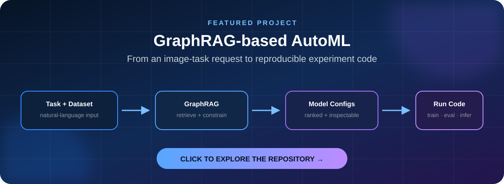

<div align="center">

# Hi, I'm Zeyu Wang 👋

### Computer Science student at TU Berlin

I am interested in **machine learning engineering**, **reproducible experimentation**, and **AI systems**.

<br>

<a href="https://github.com/Isso-W/RDPRO-SS26-Project">
  
</a>

<br>

[](https://github.com/Isso-W/RDPRO-SS26-Project)
[](https://github.com/Isso-W/RDPRO-SS26-Project/stargazers)

</div>

## 🚀 Featured Project

### [GraphRAG-based AutoML Benchmark Agent](https://github.com/Isso-W/RDPRO-SS26-Project)

A computer-vision AutoML prototype that turns a natural-language task and an image dataset into **compatible model recommendations** and **runnable experiment code**.

```text
Task request + image dataset
            ↓
Requirement and dataset analysis
            ↓
Graph constraints + semantic retrieval
            ↓
Ranked model configurations
            ↓
Training, evaluation and inference code
```

**Why it is interesting**

- Uses a knowledge graph to rule out incompatible model configurations.
- Adds semantic retrieval so users can describe tasks in natural language.
- Produces structured, inspectable model recommendations.
- Generates runnable training, evaluation and inference projects.
- Includes reproducible experiments, smoke tests and stored evidence.

### My contribution

I developed the project's **standalone MLE-style Kaggle benchmark reproduction framework**, including:

- benchmark adapters and experiment execution;
- metric handling, search and refinement components;
- smoke experiments and automated tests;
- Kaggle benchmark metadata and helper scripts;
- documentation for the reproduction and evaluation protocol.

[**See my contribution in the project →**](https://github.com/Isso-W/RDPRO-SS26-Project/blob/main/CONTRIBUTIONS.md#zeyu-wang)

<div align="center">

### If AutoML, GraphRAG or ML agents interest you,
### [take a look at the repository](https://github.com/Isso-W/RDPRO-SS26-Project) and leave a ⭐

</div>

---

## 🛠 Focus


## 📫 Connect

[](https://github.com/muzhi-hac)
